# Typecho 文章订阅插件 (Subscribe Plugin)

> 一个功能强大的 Typecho 文章订阅插件，支持手动选择文章发送给订阅者，拥有精美的邮件模板和完善的后台管理功能。

## 🌟 特性

- ✅ **手动文章推送** - 精选文章手动发送给订阅者
- 🎨 **美观邮件模板** - 现代化设计的邮件模板，支持自定义
- 📊 **数据统计分析** - 订阅者增长趋势图表和详细统计
- 👥 **订阅者管理** - 完整的订阅者增删改查功能
- 📧 **SMTP 邮件发送** - 支持各种邮件服务商
- 🔄 **订阅/退订流程** - 完整的订阅确认和退订机制
- 📱 **响应式设计** - 邮件和管理界面完美适配移动端
- 📝 **发送记录** - 详细的邮件发送历史记录
- 🎯 **灵活选择** - 可选择特定文章和特定订阅者群体

## 🗺️ 项目架构思维导图

```mermaid
graph TB
    A[Subscribe Plugin] --> B[核心文件]
    A --> C[功能模块]
    A --> D[数据管理]
    A --> E[用户界面]
    
    B --> B1[Plugin.php - 主插件文件]
    B --> B2[Action.php - 前端处理]
    B --> B3[manage.php - 后台管理]
    
    C --> C1[邮件发送模块]
    C --> C2[订阅管理模块]
    C --> C3[统计分析模块]
    C --> C4[模板系统]
    
    C1 --> C1a[SMTP 配置]
    C1 --> C1b[PHPMailer 集成]
    C1 --> C1c[批量发送]
    C1 --> C1d[发送记录]
    
    C2 --> C2a[订阅处理]
    C2 --> C2b[退订处理]
    C2 --> C2c[状态管理]
    C2 --> C2d[Token 验证]
    
    C3 --> C3a[ECharts 图表]
    C3 --> C3b[趋势分析]
    C3 --> C3c[数据统计]
    
    C4 --> C4a[邮件头部模板]
    C4 --> C4b[文章项目模板]
    C4 --> C4c[邮件底部模板]
    C4 --> C4d[整体样式模板]
    
    D --> D1[subscribers - 订阅者表]
    D --> D2[send_log - 发送记录表]
    D --> D3[subscriber_stats - 统计表]
    
    D1 --> D1a[email, name, status]
    D1 --> D1b[subscribe_time, token]
    
    D2 --> D2a[article_ids, subscriber_ids]
    D2 --> D2b[subject, send_time, status]
    
    D3 --> D3a[date, active_count]
    D3 --> D3b[new_count, unsubscribe_count]
    
    E --> E1[前端订阅表单]
    E --> E2[后台管理界面]
    E --> E3[退订确认页面]
    
    E1 --> E1a[AJAX 订阅]
    E1 --> E1b[邮箱验证]
    
    E2 --> E2a[统计面板]
    E2 --> E2b[文章选择]
    E2 --> E2c[订阅者管理]
    E2 --> E2d[发送历史]
    
    E3 --> E3a[友好提示]
    E3 --> E3b[重新订阅选项]
    
    style A fill:#e1f5fe
    style B fill:#f3e5f5
    style C fill:#e8f5e8
    style D fill:#fff3e0
    style E fill:#fce4ec
```



## 📋 测试环境

- **Typecho**: 1.2.1
- **PHP**: 8.2
- **数据库**: MySQL 7.5


## 🚀 安装步骤

### 1. 下载插件
```bash
# 下载到 Typecho 插件目录
cd /path/to/typecho/usr/plugins/
git clone https://github.com/TGU-HansJack/typecho-subscribe-plugin.git Subscribe
```

### 2. 安装 PHPMailer
插件需要 PHPMailer 库来发送邮件：

```bash
cd Subscribe
mkdir -p lib/PHPMailer
# 下载 PHPMailer 到 lib/PHPMailer/ 目录
# 确保包含：PHPMailer.php, SMTP.php, Exception.php
```

### 3. 激活插件
1. 登录 Typecho 后台
2. 进入 **控制台 → 插件管理**
3. 找到 "Subscribe" 插件，点击 **启用**
4. 插件会自动创建必要的数据库表

### 4. 配置 SMTP
1. 进入 **控制台 → 插件配置 → Subscribe**
2. 填写 SMTP 服务器配置：
   - **SMTP服务器**: 如 `smtp.gmail.com`
   - **SMTP端口**: 通常为 `587` (TLS) 或 `465` (SSL)
   - **SMTP用户名**: 发送邮件的邮箱地址
   - **SMTP密码**: 邮箱密码或应用专用密码
   - **加密方式**: 选择 TLS 或 SSL

## 🎯 使用方法

### 前端订阅表单

在主题模板中添加订阅表单：

```html
<!-- 简单订阅表单 -->
<div class="subscribe-form">
    <h3>订阅我们的文章</h3>
    <form id="subscribe-form">
        <input type="email" name="email" placeholder="请输入您的邮箱" required>
        <input type="text" name="name" placeholder="姓名（可选）">
        <button type="submit">订阅</button>
    </form>
</div>

<script>
document.getElementById('subscribe-form').addEventListener('submit', function(e) {
    e.preventDefault();
    
    const formData = new FormData(this);
    formData.append('do', 'subscribe');
    
    fetch('/action/subscribe', {
        method: 'POST',
        body: formData
    })
    .then(response => response.json())
    .then(data => {
        alert(data.message);
        if (data.success) {
            this.reset();
        }
    })
    .catch(error => {
        alert('订阅失败，请稍后重试');
    });
});
</script>
```

### 后台管理

1. **发送邮件**
   - 选择要推送的文章（支持多选）
   - 选择目标订阅者群体
   - 自定义邮件标题（可选）
   - 点击发送

2. **订阅者管理**
   - 查看所有订阅者信息
   - 手动添加订阅者
   - 切换订阅状态
   - 批量删除操作

3. **数据统计**
   - 订阅者数量统计
   - 30天增长趋势图表
   - 发送记录查看

## 🎨 自定义邮件模板

插件支持完全自定义邮件模板，包括：

### 可用变量

**邮件主题模板**:
- `{siteName}` - 网站名称
- `{articleCount}` - 文章数量
- `{date}` - 当前日期

**邮件内容模板**:
- `{articleTitle}` - 文章标题
- `{articleLink}` - 文章链接
- `{articleAuthor}` - 文章作者
- `{articleDate}` - 发布日期
- `{articleSummary}` - 文章摘要
- `{unsubscribeLink}` - 退订链接
- `{currentYear}` - 当前年份
- `{currentDateTime}` - 当前时间

### 默认模板样式

插件提供了现代化的邮件模板设计：
- 渐变色背景
- 圆角卡片布局
- 响应式设计
- 优雅的排版
- 清晰的视觉层次

## 📊 数据库结构

### subscribers 表
```sql
CREATE TABLE `subscribers` (
  `id` int(11) NOT NULL AUTO_INCREMENT,
  `email` varchar(255) NOT NULL,
  `name` varchar(100) DEFAULT '',
  `status` tinyint(1) DEFAULT 1,
  `subscribe_time` datetime DEFAULT CURRENT_TIMESTAMP,
  `unsubscribe_time` datetime DEFAULT NULL,
  `token` varchar(32) NOT NULL,
  PRIMARY KEY (`id`),
  UNIQUE KEY `email` (`email`)
);
```

### send_log 表
```sql
CREATE TABLE `send_log` (
  `id` int(11) NOT NULL AUTO_INCREMENT,
  `article_ids` text NOT NULL,
  `subscriber_ids` text NOT NULL,
  `subject` varchar(255) NOT NULL,
  `send_time` datetime DEFAULT CURRENT_TIMESTAMP,
  `status` tinyint(1) DEFAULT 1,
  `error_msg` text,
  PRIMARY KEY (`id`)
);
```

### subscriber_stats 表
```sql
CREATE TABLE `subscriber_stats` (
  `id` int(11) NOT NULL AUTO_INCREMENT,
  `date` date NOT NULL,
  `active_count` int(11) DEFAULT 0,
  `new_count` int(11) DEFAULT 0,
  `unsubscribe_count` int(11) DEFAULT 0,
  PRIMARY KEY (`id`),
  UNIQUE KEY `date` (`date`)
);
```

## 🔧 常见问题

### Q: 邮件发送失败怎么办？
A: 
1. 检查 SMTP 配置是否正确
2. 确认邮箱密码/应用专用密码
3. 检查服务器防火墙设置
4. 查看发送记录中的错误信息

### Q: 如何自定义邮件模板？
A: 
1. 进入插件配置页面
2. 在"文章推送邮件模板"部分修改各个模板
3. 使用提供的变量来动态填充内容
4. 保存配置后发送测试邮件

### Q: 如何批量导入订阅者？
A: 
目前插件支持后台手动添加，批量导入功能将在后续版本中提供。

### Q: 退订链接不工作？
A: 
1. 检查 URL 重写规则是否正确
2. 确认 Typecho 的 Action 机制正常工作
3. 检查 token 是否有效

## 🛡️ 安全注意事项

1. **SMTP 密码保护**: 使用应用专用密码而非主密码
2. **Token 验证**: 退订链接使用唯一 token 验证
3. **邮箱验证**: 前端和后端都进行邮箱格式验证
4. **SQL 注入防护**: 使用 Typecho 的数据库抽象层
5. **XSS 防护**: 所有输出都进行 HTML 转义

## 🔄 更新日志

### v1.0.0 (2024-01-XX)
- 🎉 首次发布
- ✨ 基础订阅/退订功能
- 📧 SMTP 邮件发送
- 🎨 美观的邮件模板
- 📊 统计图表功能
- 👥 订阅者管理界面

## 🗺️ 未来计划

- [ ] 📦 批量导入/导出订阅者
- [ ] 🔄 自动定时发送
- [ ] 📱 邮件模板更多样式选择
- [ ] 🎯 订阅者分组功能
- [ ] 📈 更详细的统计分析
- [ ] 🔗 与其他插件集成
- [ ] 🌐 多语言支持

## 💝 致谢

感谢以下开源项目和贡献者：

### 核心依赖
- **[Typecho](https://typecho.org/)** - 优雅的博客系统
- **[PHPMailer](https://github.com/PHPMailer/PHPMailer)** - 强大的邮件发送库
- **[ECharts](https://echarts.apache.org/)** - 专业的数据可视化图表库

### 设计灵感
- **现代化邮件设计** - 参考了各大平台的邮件模板设计
- **管理界面设计** - 借鉴了现代后台管理系统的设计理念

### 技术支持
- **Typecho 社区** - 提供了丰富的开发文档和社区支持
- **PHP 社区** - 提供了强大的生态系统

### 特别致谢
- **Claude AI (Anthropic)** - 在代码优化、架构设计、文档编写等方面提供了重要的技术支持和建议，帮助提升了插件的代码质量和用户体验
- **所有测试用户** - 感谢在开发过程中提供反馈的用户们
- **开源社区** - 感谢所有为开源事业做出贡献的开发者们

## 📄 许可证

本项目采用 [MIT License](LICENSE) 开源协议。

## 🤝 贡献

欢迎提交 Issue 和 Pull Request！

1. Fork 本项目
2. 创建特性分支 (`git checkout -b feature/AmazingFeature`)
3. 提交更改 (`git commit -m 'Add some AmazingFeature'`)
4. 推送到分支 (`git push origin feature/AmazingFeature`)
5. 打开 Pull Request

## 📞 支持

- **问题反馈**: [GitHub Issues](https://github.com/your-repo/issues)
- **功能建议**: [GitHub Discussions](https://github.com/your-repo/discussions)
- **文档问题**: 欢迎提交 PR 改进文档

---

<div align="center">

**如果这个插件对您有帮助，请给我们一个 ⭐ Star！**

Made with ❤️ for Typecho Community

</div>
